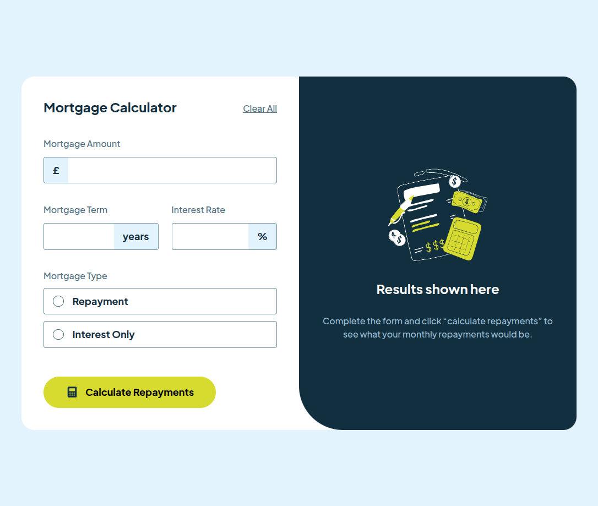
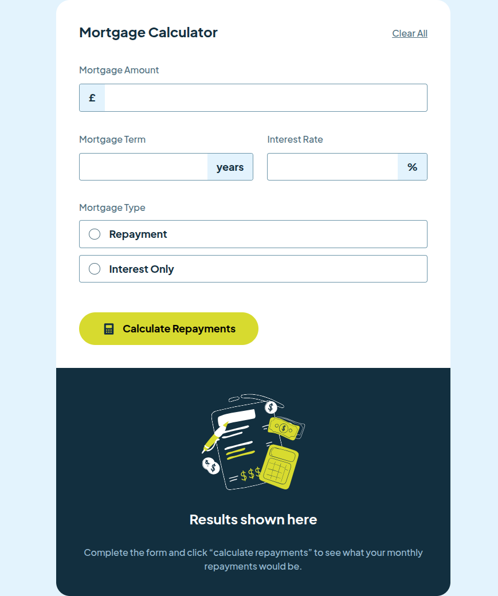
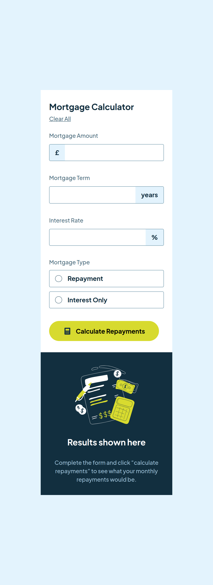
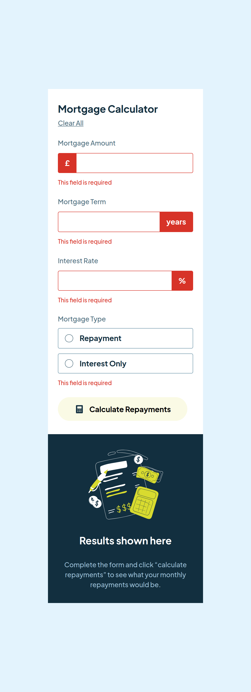

# Frontend Mentor - Mortgage repayment calculator solution

Це домашнє завдання по [Mortgage repayment calculator challenge on Frontend Mentor](https://www.frontendmentor.io/challenges/mortgage-repayment-calculator-Galx1LXK73)

## Table of contents

- [Frontend Mentor - Mortgage repayment calculator solution](#frontend-mentor---mortgage-repayment-calculator-solution)
  - [Table of contents](#table-of-contents)
  - [Overview](#overview)
    - [The challenge](#the-challenge)
    - [Screenshot](#screenshot)
    - [Links](#links)
  - [My process](#my-process)
    - [Built with](#built-with)
    - [What I learned](#what-i-learned)
      - [HTML \& CSS](#html--css)
      - [JavaScript](#javascript)
    - [Continued development](#continued-development)


## Overview
 В цьому проєкті потрібно створити калькулятор іпотечних платежів і зробити його максимально наближеним до дизайну.


### The challenge
Користувачі повинні мати можливість:
- Вводити інформацію про іпотеку та переглядати щомісячні платежі та загальну суму платежів після надсилання форми
- Переглядати повідомлення про перевірку форми, якщо якесь поле не заповнене
- Заповнювати форму лише за допомогою клавіатури
- Переглядати оптимальний макет інтерфейсу залежно від розміру екрана їхнього пристрою
- Переглядати стани наведення курсора та фокусування для всіх інтерактивних елементів на сторінці

### Screenshot







### Links

- Solution URL: [GitHub](https://github.com/slavon213/mortgage-repayment-calculator)
- Live Site URL: [Add live site URL here](https://your-live-site-url.com)

## My process

### Built with

- Semantic HTML5 markup
- CSS custom properties
- Flexbox
- CSS Grid
- JavaScript


### What I learned

#### HTML & CSS
У цьому проєкті я покращував навики роботи з формами. Для себе вибрав 2 способи створення кастомних полів та іконок:

1. За допомогою `div`, в якому вкладається `input` і `label`

```html
 <div class="flx-column">
    <label for="amount" class="text-preset-4">Mortgage Amount</label>
    <input type="text" id="amount" class="icon prefix text-preset-3" />
 </div>
``` 
  

2. За допомогою `div`, в ньому перший `label` для підпису поля, потім ще один `label` а в ньому можна вкладати `input`, зображення, текст.
```html
 <div class="flx-column">
    <label for="term" class="text-preset-4">Mortgage Term</label>
    <label class="input grd suffix">
        <input type="text" name="term" id="term" class="text-preset-3" />
        <span class="text-preset-3">years</span>
    </label>
    <small class="text-preset-5"></small>
</div>
```
ТАкож можна для контейнерів, які  будуть огортати поля вводу додавати в CSS клас `.form-control`. Тоді його можна додавати і для першого варіанту, і для другого, а вигляд буде однаковий.

#### JavaScript 

Під час роботи з  JavaScript старався розбивати код на дрібніші функції, робити їх універсальними. 

При обробці полів вводу використовував функції з регулярними виразами від іншого свого проєкту ([Tip Calculator](https://github.com/slavon213/tip-calculator) від FrontendMentor).

Дізнався, що для форматування чисел, дат та іншого в залежності від встановленої локалі  можна використовувати вбудований [Intl JavaScript API](https://developer.mozilla.org/en-US/docs/Web/JavaScript/Reference/Global_Objects/Intl).

Приклад форматування числа комами:

```js
const pay = 42;
const formattedMonthly = new Intl.NumberFormat(currentLocale, {
        style: "currency",
        currency: currency,
    }).format(pay);

// Вивід console.log(formattedMonthly) --- '£42.00'
```


### Continued development

Буду продовжувати навчання з обробки і стилізації форм та їх елементів. 
